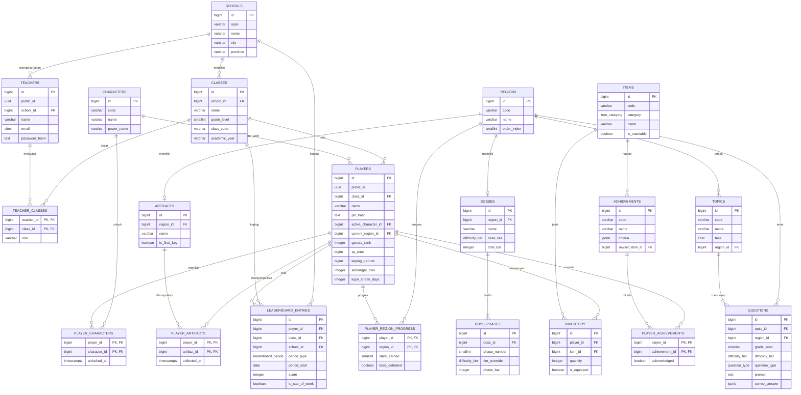

# Legenda Garuda: Petualangan Matematika Nusantara
## Database Schema — PostgreSQL — Phase 1: Discovery, Prompt 11

> **Catatan konsistensi istilah**: skema ini memetakan istilah desain (Prompt 1-10) ke kolom database sebagai berikut — **Keping Garuda** → `players.keping_garuda`, **Garuda Rank** → `players.garuda_rank`, **Sahabat Garuda** → `characters` + `player_characters`, **Prasasti Bilangan** → `artifacts` + `player_artifacts`, **Pusaka Garuda** (Bulu Waktu/Petunjuk/Pelindung) → `items` (category=`pusaka`) + `inventory`, **Sosok Kabut yang Tersesat** → `bosses`, **Bar Kebingungan** (per fase) → `bosses.total_bar` / `boss_phases.phase_bar`, **Tier Tunas/Pelajar/Cendekia** → enum `difficulty_tier`, **Kode Kelas** (login siswa) → `classes.class_code`.

---

## 1. ERD (Entity Relationship Diagram)



---

## 2. SQL Schema

### 2.1 Extensions & Enum Types

```sql
CREATE EXTENSION IF NOT EXISTS pgcrypto;  -- gen_random_uuid()
CREATE EXTENSION IF NOT EXISTS citext;    -- email case-insensitive

CREATE TYPE difficulty_tier AS ENUM ('tunas', 'pelajar', 'cendekia');
CREATE TYPE kurikulum_fase AS ENUM ('A', 'B', 'C');
CREATE TYPE question_type AS ENUM (
    'multiple_choice', 'numeric_input', 'drag_drop', 'matching', 'true_false'
);
CREATE TYPE item_category AS ENUM ('pusaka', 'kostum', 'koleksi', 'companion');
CREATE TYPE boss_phase_style AS ENUM ('basic', 'combo', 'story');
CREATE TYPE leaderboard_period AS ENUM ('daily', 'weekly');
CREATE TYPE inventory_source AS ENUM ('reward', 'shop', 'achievement', 'event', 'starter');
```

---

### 2.2 Schools

```sql
CREATE TABLE schools (
    id          BIGINT GENERATED ALWAYS AS IDENTITY PRIMARY KEY,
    npsn        VARCHAR(20) UNIQUE,           -- Nomor Pokok Sekolah Nasional
    name        VARCHAR(150) NOT NULL,
    city        VARCHAR(100),
    province    VARCHAR(100),
    created_at  TIMESTAMPTZ NOT NULL DEFAULT now()
);
```

### 2.3 Classes

```sql
CREATE TABLE classes (
    id              BIGINT GENERATED ALWAYS AS IDENTITY PRIMARY KEY,
    school_id       BIGINT NOT NULL REFERENCES schools(id) ON DELETE CASCADE,
    name            VARCHAR(50) NOT NULL,         -- contoh: "4A"
    grade_level     SMALLINT NOT NULL CHECK (grade_level BETWEEN 1 AND 6),
    class_code      VARCHAR(10) NOT NULL UNIQUE,  -- kode login siswa (Login screen)
    academic_year   VARCHAR(9) NOT NULL,          -- contoh: "2025/2026"
    created_at      TIMESTAMPTZ NOT NULL DEFAULT now(),
    UNIQUE (school_id, name, academic_year)
);
```

### 2.4 Teachers

```sql
CREATE TABLE teachers (
    id              BIGINT GENERATED ALWAYS AS IDENTITY PRIMARY KEY,
    public_id       UUID NOT NULL DEFAULT gen_random_uuid() UNIQUE, -- subject JWT
    school_id       BIGINT NOT NULL REFERENCES schools(id) ON DELETE CASCADE,
    name            VARCHAR(150) NOT NULL,
    email           CITEXT NOT NULL UNIQUE,
    password_hash   TEXT NOT NULL,
    created_at      TIMESTAMPTZ NOT NULL DEFAULT now(),
    last_login_at   TIMESTAMPTZ
);

-- Relasi many-to-many guru <-> kelas (satu guru bisa pegang >1 kelas)
CREATE TABLE teacher_classes (
    teacher_id  BIGINT NOT NULL REFERENCES teachers(id) ON DELETE CASCADE,
    class_id    BIGINT NOT NULL REFERENCES classes(id) ON DELETE CASCADE,
    role        VARCHAR(20) NOT NULL DEFAULT 'homeroom',
    PRIMARY KEY (teacher_id, class_id)
);
```

---

### 2.5 Reference Data: Characters (Sahabat Garuda)

```sql
CREATE TABLE characters (
    id                  BIGINT GENERATED ALWAYS AS IDENTITY PRIMARY KEY,
    code                VARCHAR(20) NOT NULL UNIQUE,   -- 'sari','bayu','made','tiwi','rian'
    name                VARCHAR(50) NOT NULL,
    origin_region       VARCHAR(50) NOT NULL,
    personality         TEXT,
    power_name          VARCHAR(50) NOT NULL,          -- "Kekuatan Sahabat"
    power_description   TEXT,
    unlock_order        SMALLINT NOT NULL DEFAULT 1
);
```

### 2.6 Reference Data: Regions (World Bible)

```sql
CREATE TABLE regions (
    id              BIGINT GENERATED ALWAYS AS IDENTITY PRIMARY KEY,
    code            VARCHAR(30) NOT NULL UNIQUE,  -- 'sumatra'..'papua','istana_garuda'
    name            VARCHAR(100) NOT NULL,
    order_index     SMALLINT NOT NULL UNIQUE,     -- urutan progres 1..8
    min_grade_level SMALLINT,
    max_grade_level SMALLINT,
    description     TEXT
);
```

### 2.7 Reference Data: Topics (Curriculum Mapping)

```sql
CREATE TABLE topics (
    id              BIGINT GENERATED ALWAYS AS IDENTITY PRIMARY KEY,
    code            VARCHAR(40) NOT NULL UNIQUE,
    name            VARCHAR(100) NOT NULL,
    fase            kurikulum_fase NOT NULL,
    grade_level_min SMALLINT NOT NULL CHECK (grade_level_min BETWEEN 1 AND 6),
    grade_level_max SMALLINT NOT NULL CHECK (grade_level_max BETWEEN 1 AND 6),
    region_id       BIGINT REFERENCES regions(id)
);
```

---

### 2.8 Questions

```sql
CREATE TABLE questions (
    id                  BIGINT GENERATED ALWAYS AS IDENTITY PRIMARY KEY,
    topic_id            BIGINT NOT NULL REFERENCES topics(id),
    region_id           BIGINT REFERENCES regions(id),   -- konteks tematik (opsional)
    grade_level         SMALLINT NOT NULL CHECK (grade_level BETWEEN 1 AND 6),
    difficulty_tier     difficulty_tier NOT NULL,
    question_type       question_type NOT NULL,
    prompt              TEXT NOT NULL,
    media_url           TEXT,
    options             JSONB,             -- array opsi (multiple_choice/matching/drag_drop)
    correct_answer      JSONB NOT NULL,
    explanation         TEXT,              -- dipakai saat Bantuan Garuda (hint)
    time_limit_seconds  SMALLINT NOT NULL DEFAULT 15,
    is_active           BOOLEAN NOT NULL DEFAULT true,
    created_at          TIMESTAMPTZ NOT NULL DEFAULT now(),
    updated_at          TIMESTAMPTZ NOT NULL DEFAULT now()
);
```

---

### 2.9 Bosses (Sosok Kabut yang Tersesat / Tantangan Besar)

```sql
CREATE TABLE bosses (
    id              BIGINT GENERATED ALWAYS AS IDENTITY PRIMARY KEY,
    region_id       BIGINT NOT NULL UNIQUE REFERENCES regions(id),
    name            VARCHAR(100) NOT NULL,   -- "Ombak Hitam", "Patih Angka Hitam", dst.
    lore            TEXT,
    base_tier       difficulty_tier NOT NULL DEFAULT 'tunas',
    total_bar       INTEGER NOT NULL,        -- bossTotalBar(regionIndex)
    phase_count     SMALLINT NOT NULL DEFAULT 3
);

-- 3 fase per Tantangan Besar (Battle Engine, Prompt 7)
CREATE TABLE boss_phases (
    id              BIGINT GENERATED ALWAYS AS IDENTITY PRIMARY KEY,
    boss_id         BIGINT NOT NULL REFERENCES bosses(id) ON DELETE CASCADE,
    phase_number    SMALLINT NOT NULL CHECK (phase_number BETWEEN 1 AND 3),
    tier_override   difficulty_tier NOT NULL,
    phase_bar       INTEGER NOT NULL,        -- bossTotalBar / PHASE_COUNT
    phase_style     boss_phase_style NOT NULL,
    UNIQUE (boss_id, phase_number)
);
```

### 2.10 Artifacts (Prasasti Bilangan)

```sql
CREATE TABLE artifacts (
    id              BIGINT GENERATED ALWAYS AS IDENTITY PRIMARY KEY,
    region_id       BIGINT UNIQUE REFERENCES regions(id),
    name            VARCHAR(100) NOT NULL,   -- "Prasasti Selat Emas", dst.
    description     TEXT,
    image_url       TEXT,
    is_final_key    BOOLEAN NOT NULL DEFAULT false  -- "Prasasti Cenderawasih"
);
```

---

### 2.11 Items (Pusaka Garuda / Kostum / Koleksi / Companion)

```sql
CREATE TABLE items (
    id              BIGINT GENERATED ALWAYS AS IDENTITY PRIMARY KEY,
    code            VARCHAR(40) NOT NULL UNIQUE,
    category        item_category NOT NULL,
    name            VARCHAR(100) NOT NULL,
    description     TEXT,
    icon_url        TEXT,
    effect_type     VARCHAR(40),    -- 'extra_time' | 'hint' | 'combo_shield' (pusaka)
    effect_value    JSONB,
    is_stackable    BOOLEAN NOT NULL DEFAULT false,
    rarity          VARCHAR(20) NOT NULL DEFAULT 'common'
);
```

### 2.12 Achievements

```sql
CREATE TABLE achievements (
    id                      BIGINT GENERATED ALWAYS AS IDENTITY PRIMARY KEY,
    code                    VARCHAR(40) NOT NULL UNIQUE,
    name                    VARCHAR(100) NOT NULL,
    description             TEXT,
    icon_url                TEXT,
    criteria                JSONB NOT NULL,   -- contoh: {"type":"topic_accuracy","topic_code":"sisa_bagi","min_accuracy":0.9}
    reward_xp               INTEGER NOT NULL DEFAULT 0,
    reward_keping_garuda    INTEGER NOT NULL DEFAULT 0,
    reward_item_id          BIGINT REFERENCES items(id)
);
```

---

### 2.13 Players

```sql
CREATE TABLE players (
    id                  BIGINT GENERATED ALWAYS AS IDENTITY PRIMARY KEY,
    public_id           UUID NOT NULL DEFAULT gen_random_uuid() UNIQUE, -- subject JWT
    class_id            BIGINT NOT NULL REFERENCES classes(id) ON DELETE CASCADE,
    name                VARCHAR(80) NOT NULL,
    pin_hash            TEXT NOT NULL,                  -- PIN 4 digit (hashed)
    active_character_id BIGINT REFERENCES characters(id),
    current_region_id   BIGINT REFERENCES regions(id),  -- untuk "Lanjutkan Petualangan"
    garuda_rank         INTEGER NOT NULL DEFAULT 1,      -- level
    xp_total            BIGINT NOT NULL DEFAULT 0,
    keping_garuda       BIGINT NOT NULL DEFAULT 0,       -- currency
    semangat_max        INTEGER NOT NULL DEFAULT 100,    -- naik +5 tiap level up
    login_streak_days   INTEGER NOT NULL DEFAULT 0,
    last_login_date     DATE,
    created_at          TIMESTAMPTZ NOT NULL DEFAULT now(),
    updated_at          TIMESTAMPTZ NOT NULL DEFAULT now()
);
```

### 2.14 Player Relations (Junction Tables)

```sql
-- Sahabat Garuda yang sudah ter-unlock untuk pemain
CREATE TABLE player_characters (
    player_id       BIGINT NOT NULL REFERENCES players(id) ON DELETE CASCADE,
    character_id    BIGINT NOT NULL REFERENCES characters(id),
    unlocked_at     TIMESTAMPTZ NOT NULL DEFAULT now(),
    PRIMARY KEY (player_id, character_id)
);

-- Prasasti Bilangan yang sudah dikumpulkan
CREATE TABLE player_artifacts (
    player_id       BIGINT NOT NULL REFERENCES players(id) ON DELETE CASCADE,
    artifact_id     BIGINT NOT NULL REFERENCES artifacts(id),
    collected_at    TIMESTAMPTZ NOT NULL DEFAULT now(),
    PRIMARY KEY (player_id, artifact_id)
);

-- Progres per region di World Map (stages, bintang, status boss)
CREATE TABLE player_region_progress (
    player_id           BIGINT NOT NULL REFERENCES players(id) ON DELETE CASCADE,
    region_id           BIGINT NOT NULL REFERENCES regions(id),
    stages_completed    SMALLINT NOT NULL DEFAULT 0,
    stars_earned        SMALLINT NOT NULL DEFAULT 0 CHECK (stars_earned BETWEEN 0 AND 3),
    boss_defeated       BOOLEAN NOT NULL DEFAULT false,
    unlocked_at         TIMESTAMPTZ,
    completed_at        TIMESTAMPTZ,
    PRIMARY KEY (player_id, region_id)
);

-- Achievement yang sudah diraih
CREATE TABLE player_achievements (
    player_id       BIGINT NOT NULL REFERENCES players(id) ON DELETE CASCADE,
    achievement_id  BIGINT NOT NULL REFERENCES achievements(id),
    unlocked_at     TIMESTAMPTZ NOT NULL DEFAULT now(),
    acknowledged    BOOLEAN NOT NULL DEFAULT false,  -- sudah dilihat di Rewards screen
    PRIMARY KEY (player_id, achievement_id)
);
```

### 2.15 Inventory

```sql
CREATE TABLE inventory (
    id              BIGINT GENERATED ALWAYS AS IDENTITY PRIMARY KEY,
    player_id       BIGINT NOT NULL REFERENCES players(id) ON DELETE CASCADE,
    item_id         BIGINT NOT NULL REFERENCES items(id),
    quantity        INTEGER NOT NULL DEFAULT 1 CHECK (quantity >= 0),
    is_equipped     BOOLEAN NOT NULL DEFAULT false,  -- kostum/companion
    source          inventory_source NOT NULL DEFAULT 'reward',
    acquired_at     TIMESTAMPTZ NOT NULL DEFAULT now(),
    UNIQUE (player_id, item_id)
);
```

---

### 2.16 Leaderboard

```sql
CREATE TABLE leaderboard_entries (
    id              BIGINT GENERATED ALWAYS AS IDENTITY PRIMARY KEY,
    player_id       BIGINT NOT NULL REFERENCES players(id) ON DELETE CASCADE,
    class_id        BIGINT NOT NULL REFERENCES classes(id),  -- denormalized untuk scope kelas
    school_id       BIGINT NOT NULL REFERENCES schools(id),  -- denormalized untuk scope sekolah
    period_type     leaderboard_period NOT NULL,
    period_start    DATE NOT NULL,           -- awal hari (daily) atau awal minggu (weekly)
    score           INTEGER NOT NULL DEFAULT 0,  -- XP diperoleh selama periode
    is_star_of_week BOOLEAN NOT NULL DEFAULT false,
    updated_at      TIMESTAMPTZ NOT NULL DEFAULT now(),
    UNIQUE (player_id, period_type, period_start)
);
```

> **Catatan**: `rank` (posisi peringkat) sengaja **tidak** disimpan sebagai kolom — dihitung saat query via `RANK() OVER (PARTITION BY class_id, period_type, period_start ORDER BY score DESC)` agar selalu konsisten tanpa risiko data basi.

---

## 3. Index Strategy

| # | Tabel | Index | Tipe | Tujuan / Pola Query |
|---|---|---|---|---|
| 1 | `classes` | `UNIQUE (class_code)` | B-tree (implisit dari UNIQUE) | Login siswa — `POST /auth/student/login` mencari kelas via kode |
| 2 | `teachers` | `UNIQUE (email)` | B-tree (CITEXT) | Login guru — `POST /auth/teacher/login` |
| 3 | `players` | `UNIQUE (public_id)` | B-tree | Resolusi JWT subject ke player tanpa expose ID sekuensial |
| 4 | `players` | `idx_players_class_id (class_id)` | B-tree | Teacher Dashboard — daftar siswa per kelas `GET /teacher/classes/{id}/students` |
| 5 | `players` | `idx_players_class_pin (class_id, name)` | B-tree | Login siswa — cocokkan nama dalam kelas sebelum verifikasi PIN |
| 6 | `teacher_classes` | `idx_teacher_classes_class_id (class_id)` | B-tree | Cari semua guru pengampu suatu kelas (PK hanya mengcover `teacher_id` first) |
| 7 | `questions` | `idx_questions_selector (topic_id, difficulty_tier, grade_level) WHERE is_active` | Partial B-tree | Adaptive engine memilih soal sesuai topik+tier+kelas (Battle Engine §7) |
| 8 | `questions` | `idx_questions_region_id (region_id)` | B-tree | Soal bertema region tertentu (Tantangan Besar Fase 3 — soal cerita budaya) |
| 9 | `topics` | `idx_topics_region_id (region_id)` | B-tree | Kurikulum per region (World Map → daftar topik region) |
| 10 | `topics` | `idx_topics_fase_grade (fase, grade_level_min, grade_level_max)` | B-tree | Kurikulum Mapping per kelas (Prompt 8) |
| 11 | `bosses` | `UNIQUE (region_id)` | B-tree (implisit) | 1 boss per region; lookup boss saat masuk Tantangan Besar |
| 12 | `boss_phases` | `UNIQUE (boss_id, phase_number)` | B-tree (implisit) | Ambil fase 1/2/3 secara berurutan saat Tantangan Besar berjalan |
| 13 | `artifacts` | `UNIQUE (region_id)` | B-tree (implisit) | 1 Prasasti per region; cek status di World Map |
| 14 | `player_artifacts` | `idx_player_artifacts_player_id (player_id)` | B-tree (PK leftmost, sudah cover) | Hitung Prasasti terkumpul — `GET /player/profile`, syarat unlock Istana Garuda |
| 15 | `player_region_progress` | `idx_prp_player_id (player_id)` | B-tree (PK leftmost, sudah cover) | Render status semua node World Map — `GET /world/regions/{id}/progress` |
| 16 | `player_characters` | `idx_pc_player_id (player_id)` | B-tree (PK leftmost, sudah cover) | Roster Sahabat Garuda ter-unlock — Profile screen |
| 17 | `inventory` | `UNIQUE (player_id, item_id)` | B-tree (implisit) | Cegah duplikasi baris item per pemain; basis upsert quantity |
| 18 | `inventory` | `idx_inventory_player_category (player_id, item_id) INCLUDE (quantity, is_equipped)` + join `items.category` | B-tree (covering) | Tab Inventory (`Pusaka/Kostum/Koleksi/Companion`) — `GET /player/inventory` |
| 19 | `inventory` | `idx_inventory_equipped (player_id) WHERE is_equipped` | Partial B-tree | Render kostum/companion aktif dengan cepat di Home/Profile |
| 20 | `items` | `idx_items_category (category)` | B-tree | Filter katalog per kategori saat join dengan `inventory` |
| 21 | `achievements` | `idx_achievements_criteria_type ((criteria->>'type'))` | Expression B-tree | Achievement engine memindai kriteria relevan setelah setiap event (jawaban/boss/login) |
| 22 | `player_achievements` | `idx_pa_player_unacknowledged (player_id) WHERE acknowledged = false` | Partial B-tree | Rewards screen — `GET /player/achievements/new` |
| 23 | `leaderboard_entries` | `idx_lb_class_period_score (class_id, period_type, period_start, score DESC)` | B-tree (composite) | `GET /leaderboard/class/{id}?period=daily|weekly` — ranking cepat tanpa sort tambahan |
| 24 | `leaderboard_entries` | `idx_lb_school_period_score (school_id, period_type, period_start, score DESC)` | B-tree (composite) | `GET /leaderboard/school/{id}?period=weekly` |
| 25 | `leaderboard_entries` | `idx_lb_star_of_week (class_id, period_start) WHERE is_star_of_week` | Partial B-tree | `GET /leaderboard/highlight/{classId}` — "Bintang Minggu Ini" |

### Catatan Skalabilitas

- **`questions`**: setelah bank soal tumbuh besar, kombinasikan index #7 dengan `ORDER BY random() LIMIT 1` — index menyempitkan kandidat terlebih dahulu sehingga `random()` hanya mengurutkan subset kecil, bukan seluruh tabel.
- **`leaderboard_entries`**: tabel ini bertambah ~1 baris/pemain/hari (periode `daily`). Pertimbangkan **range partitioning per bulan** pada `period_start` setelah volume signifikan (misal >1 tahun data), dan jadwalkan job untuk mengarsipkan/menghapus partisi `daily` yang sudah lewat (data `weekly` tetap dipertahankan lebih lama untuk laporan guru).
- **`inventory`**: dengan `UNIQUE (player_id, item_id)`, penambahan Pusaka stackable dilakukan via `INSERT ... ON CONFLICT (player_id, item_id) DO UPDATE SET quantity = inventory.quantity + EXCLUDED.quantity` — index unik yang sama berfungsi sebagai target konflik.

---

*Dokumen ini adalah output Phase 1 — Discovery, Prompt 11 (Database Schema — PostgreSQL) untuk proyek "Legenda Garuda: Petualangan Matematika Nusantara".*

Siap lanjut ke Prompt 12 kapan saja.
