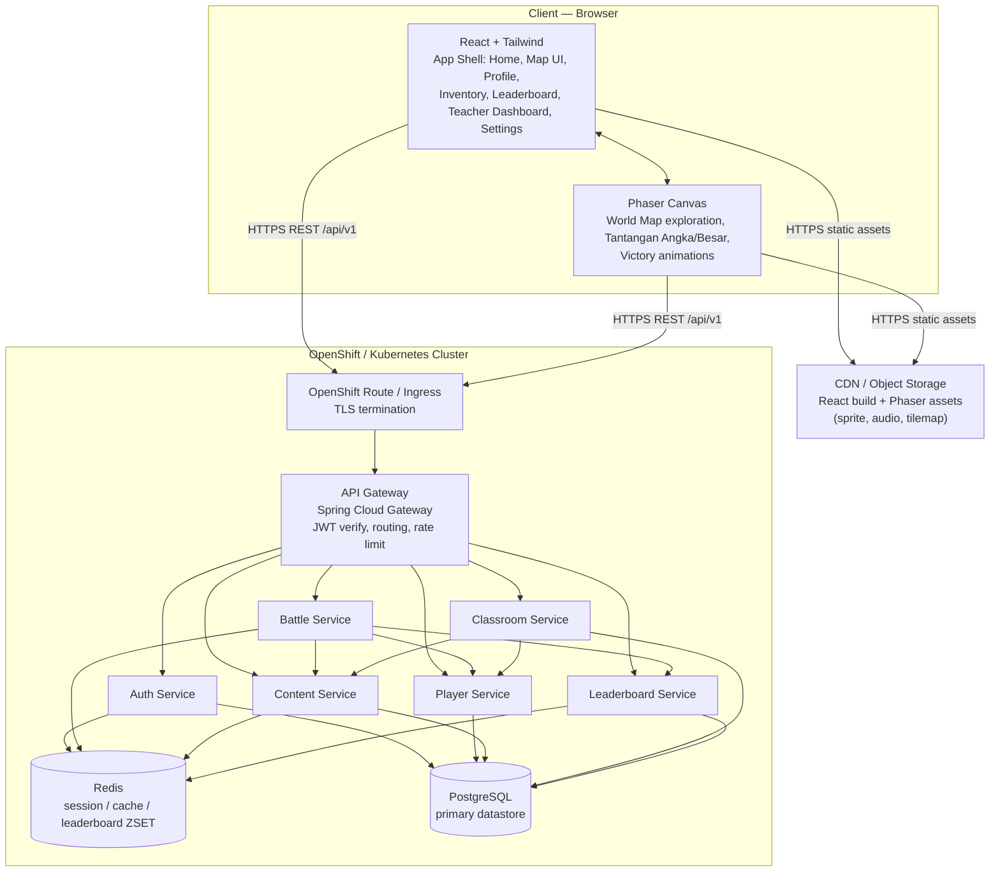
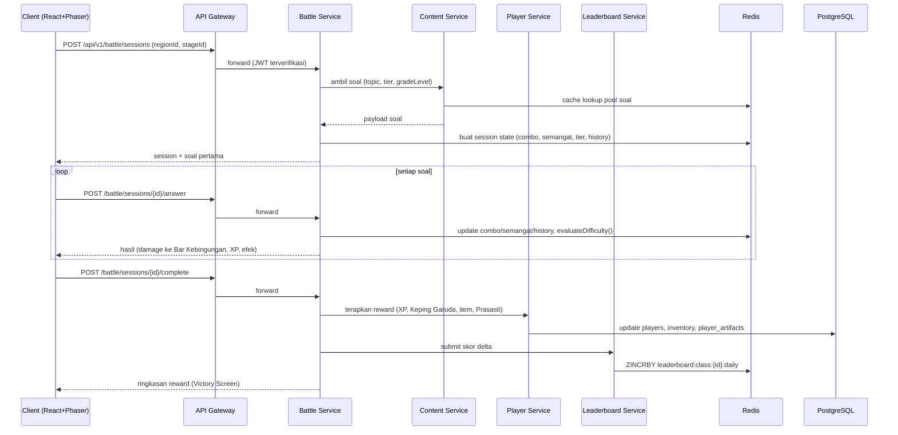

# Legenda Garuda: Petualangan Matematika Nusantara
## System Architecture — Phase 1: Discovery, Prompt 12

**Acting as**: Principal Software Architect
**Tech Stack**: Frontend — React + Phaser + Tailwind | Backend — Spring Boot + PostgreSQL + Redis | Deployment — Docker + Kubernetes + OpenShift

> **Catatan konsistensi**: arsitektur ini mengimplementasikan konvensi API `/api/v1/...` & JWT (Prompt 9), skema PostgreSQL (Prompt 11) — setiap tabel kini "dimiliki" oleh satu service, dan logika Battle Engine (Prompt 7: damage/combo/XP/adaptive difficulty) menjadi tanggung jawab **Battle Service**.

---

## 1. System Architecture

### 1.1 Gambaran Umum

Aplikasi terdiri dari **Client** (React shell untuk UI/menu + Phaser canvas untuk gameplay interaktif, di-bundle bersama dan disajikan via CDN), dan **Backend** berupa kumpulan service Spring Boot yang berjalan di OpenShift/Kubernetes di belakang satu **API Gateway**. Pendekatan: **modular service architecture** — 6 service dengan batas domain jelas (selaras tabel Prompt 11), bukan monolith tunggal maupun microservices ekstrem (>20 service) yang berlebihan untuk skala produk ini.

### 1.2 Diagram Arsitektur



### 1.3 Lapisan Arsitektur

| Lapisan | Teknologi | Tanggung Jawab |
|---|---|---|
| **Presentation** | React + Tailwind | Navigasi, layout 10 screen (Prompt 9), state global (auth, profil), form, dashboard guru |
| **Game Runtime** | Phaser 3 | World Map interaktif, Tantangan Angka/Besar (render soal, animasi Sosok Kabut, Bar Kebingungan/Semangat, efek combo) — berjalan dalam canvas yang di-embed React |
| **Edge / CDN** | CDN (mis. CloudFront/Cloudflare) + Object Storage | Hosting static build React & asset Phaser, cache global, versioning asset |
| **Gateway** | Spring Cloud Gateway (di OpenShift) | Titik masuk tunggal `/api/v1/...`, validasi JWT, rate limiting, routing ke service internal |
| **Application Services** | Spring Boot (6 service) | Logika domain — lihat Service Diagram (§2) |
| **Cache & Real-time State** | Redis | Sesi battle aktif, cache konten (soal/region/items), leaderboard sorted set, rate-limit counter |
| **Persistence** | PostgreSQL (Prompt 11) | Sumber kebenaran untuk seluruh entitas: Players, Teachers, Schools, Classes, Questions, Bosses, Artifacts, Inventory, Achievements, Leaderboard |
| **Platform** | Docker, Kubernetes, OpenShift | Containerization, orchestration, autoscaling, networking, secrets |

### 1.4 Alur Request Contoh — "Tantangan Angka"



---

## 2. Service Diagram

### 2.1 Tabel Tanggung Jawab Service

| Service | Tanggung Jawab Utama | Tabel PostgreSQL yang Dimiliki (Prompt 11) | Penggunaan Redis | Dependensi Internal | Endpoint Utama |
|---|---|---|---|---|---|
| **Auth Service** | Login siswa (kode kelas + nama + PIN) & guru (email + password), issue/refresh/revoke JWT | *(read-only: `players`, `teachers`, `classes`)* | Refresh-token store & blacklist (`auth:refresh:{tokenId}`) | - | `/auth/student/login`, `/auth/teacher/login`, `/auth/refresh`, `/auth/logout`, `/auth/change-pin` |
| **Player Service** | Profil, progres (XP/Garuda Rank/Keping Garuda), inventory, achievement, roster Sahabat Garuda, progres region | `players`, `player_characters`, `player_artifacts`, `player_region_progress`, `player_achievements`, `inventory` | Cache profil ringkas (`player:{id}:summary`, TTL pendek) | Content Service (referensi item/achievement) | `/player/profile`, `/player/summary`, `/player/inventory`, `/player/achievements`, `/player/daily-*` |
| **Content Service** | Katalog referensi: region, topik kurikulum, soal, boss & fase, artifact, item, achievement | `regions`, `topics`, `questions`, `bosses`, `boss_phases`, `artifacts`, `items`, `achievements`, `characters` | Cache agresif (`content:question-pool:{topic}:{tier}:{grade}`, `content:regions`, TTL menengah-lama) | - | `/world/regions`, `/world/regions/{id}/*`, `/content/topics`, `/content/items` |
| **Battle Service** | Orkestrasi sesi Tantangan Angka/Besar, Battle Engine (damage/combo/XP/adaptive difficulty — Prompt 7), efek Kabut/Semangat | *(tanpa tabel sendiri — state sesi di Redis)* | Session state (`battle:session:{id}`: combo, semangat, tier, answerHistory), TTL = durasi sesi | Content Service (ambil soal), Player Service (terapkan reward), Leaderboard Service (submit skor) | `/battle/sessions`, `/battle/sessions/{id}/answer`, `/battle/sessions/{id}/complete` |
| **Classroom Service** | Manajemen sekolah/kelas/guru, agregasi laporan kelas untuk Teacher Dashboard | `schools`, `classes`, `teachers`, `teacher_classes` | Cache laporan agregat (`classroom:report:{classId}:{period}`, TTL menengah) | Player Service (progres siswa), Content Service (mapping topik) | `/teacher/classes/*`, `/teacher/classes/{id}/report` |
| **Leaderboard Service** | Hitung & sajikan ranking harian/mingguan, "Bintang Minggu Ini" | `leaderboard_entries` | Sorted set real-time (`leaderboard:class:{id}:{period}:{date}`) + job sinkron periodik ke Postgres | - | `/leaderboard/class/{id}`, `/leaderboard/school/{id}`, `/leaderboard/highlight/{id}` |

### 2.2 Pola Komunikasi

- **Client → Gateway**: REST/JSON via HTTPS, selalu lewat `/api/v1/...`, JWT di header `Authorization: Bearer`.
- **Gateway → Service**: REST internal (ClusterIP Service), JWT diteruskan + diverifikasi ulang oleh service (defense in depth) menggunakan **public key** (JWT ditandatangani asimetris RS256 oleh Auth Service).
- **Service → Service**: REST sinkron untuk operasi yang butuh respons langsung (Battle → Player saat `complete`). Tidak menggunakan message broker di MVP — volume & kompleksitas belum membutuhkan; dicatat sebagai opsi masa depan (lihat §5.5) jika beban achievement-evaluation/notifikasi bertambah.
- **Service → Redis/Postgres**: setiap service hanya mengakses skema/tabel yang menjadi miliknya (lihat §2.1) — service lain mengakses data tersebut **hanya via API**, bukan query langsung ke tabel milik service lain (menjaga batas domain meski berbagi satu cluster Postgres).

---

## 3. API Design

### 3.1 Konvensi Umum

| Aspek | Konvensi |
|---|---|
| **Base path** | `/api/v1/...` (selaras Prompt 9) |
| **Auth** | `Authorization: Bearer <accessToken>` (JWT RS256) |
| **Konten** | `application/json; charset=utf-8` |
| **Pagination** | Query `?page=1&size=20` → metadata di `meta.page/size/totalItems/totalPages` |
| **Idempotency** | Endpoint mutasi penting (`/battle/sessions/{id}/complete`, `/player/daily-rewards/claim`) menerima header `Idempotency-Key` untuk mencegah duplikasi akibat retry |
| **Rate limit** | Header respons `X-RateLimit-Limit`, `X-RateLimit-Remaining`, `X-RateLimit-Reset` |
| **Penamaan** | `camelCase` untuk field JSON, `kebab-case`/`snake_case` tidak dipakai di payload |

### 3.2 Format Response & Error

**Sukses (single resource)**
```json
{
  "data": { "id": 123, "name": "Sari" },
  "meta": { "requestId": "f47ac10b-58cc-4372-a567-0e02b2c3d479", "timestamp": "2026-06-16T10:00:00Z" }
}
```

**Sukses (paginated)**
```json
{
  "data": [ { "id": 1 }, { "id": 2 } ],
  "meta": { "page": 1, "size": 20, "totalItems": 134, "totalPages": 7 }
}
```

**Error**
```json
{
  "error": {
    "code": "BATTLE_SESSION_NOT_FOUND",
    "message": "Sesi Tantangan Angka tidak ditemukan atau sudah berakhir.",
    "requestId": "f47ac10b-58cc-4372-a567-0e02b2c3d479"
  }
}
```

| Status | Penggunaan |
|---|---|
| 200 / 201 | Sukses / resource dibuat |
| 400 | Payload tidak valid |
| 401 | Token tidak ada/kadaluarsa |
| 403 | Role tidak berhak (mis. siswa akses endpoint guru) |
| 404 | Resource tidak ditemukan |
| 409 | Konflik (mis. `class_code` duplikat) |
| 422 | Validasi bisnis gagal (mis. region terkunci) |
| 429 | Rate limit terlampaui |
| 500 | Kesalahan server |

### 3.3 Katalog Endpoint per Service

**Auth Service**

| Method | Path | Deskripsi | Role |
|---|---|---|---|
| POST | `/api/v1/auth/student/login` | Login siswa (class_code + nama + PIN) | public |
| POST | `/api/v1/auth/teacher/login` | Login guru (email + password) | public |
| POST | `/api/v1/auth/refresh` | Tukar refresh token → access token baru | public (refresh token) |
| POST | `/api/v1/auth/logout` | Revoke refresh token | student, teacher |
| POST | `/api/v1/auth/change-pin` | Ganti PIN siswa | student |
| POST | `/api/v1/auth/forgot-password` | Reset password guru | public |

**Player Service**

| Method | Path | Deskripsi | Role |
|---|---|---|---|
| GET | `/api/v1/player/summary` | Ringkasan Home (XP, Keping Garuda, streak) | student |
| GET | `/api/v1/player/profile` | Profil lengkap + roster Sahabat Garuda | student |
| PATCH | `/api/v1/player/profile/active-character` | Ganti karakter aktif | student |
| GET | `/api/v1/player/stats` | Statistik akurasi per topik | student |
| GET | `/api/v1/player/region-progress` | Status semua node World Map | student |
| GET | `/api/v1/player/daily-rewards` | Status hadiah login harian | student |
| POST | `/api/v1/player/daily-rewards/claim` | Klaim hadiah harian | student |
| GET | `/api/v1/player/daily-missions` | Misi harian + progres | student |
| GET | `/api/v1/player/inventory` | Daftar item (Pusaka/Kostum/Koleksi/Companion) | student |
| GET | `/api/v1/player/inventory/{itemId}` | Detail item | student |
| PATCH | `/api/v1/player/inventory/{itemId}/equip` | Pakai/lepas kostum/companion | student |
| GET | `/api/v1/player/achievements` | Semua achievement | student |
| GET | `/api/v1/player/achievements/new` | Achievement baru (belum acknowledged) | student |
| POST | `/api/v1/player/achievements/{id}/acknowledge` | Tandai sudah dilihat | student |
| GET / PATCH | `/api/v1/player/settings` | Audio/bahasa/preferensi | student, teacher |

**Content Service**

| Method | Path | Deskripsi | Role |
|---|---|---|---|
| GET | `/api/v1/world/regions` | Daftar 7 region + Istana Garuda | student |
| GET | `/api/v1/world/regions/{regionId}` | Detail region (boss, artifact, topik) | student |
| GET | `/api/v1/world/regions/{regionId}/stages` | Daftar stage/Hub Desa | student |
| GET | `/api/v1/world/regions/{regionId}/boss` | Detail boss + 3 fase | student |
| GET | `/api/v1/content/topics` | Katalog topik kurikulum (Prompt 8) | student, teacher |
| GET | `/api/v1/content/items` | Katalog item (Pusaka/Kostum/Koleksi/Companion) | student |
| GET | `/api/v1/content/achievements` | Katalog achievement | student, teacher |
| GET | `/internal/questions/select` | *(internal)* pilih soal sesuai topic/tier/grade — dipanggil Battle Service | service-to-service |

**Battle Service**

| Method | Path | Deskripsi | Role |
|---|---|---|---|
| POST | `/api/v1/battle/sessions` | Mulai Tantangan Angka/Besar | student |
| GET | `/api/v1/battle/sessions/{id}/question` | Ambil soal berikutnya | student |
| POST | `/api/v1/battle/sessions/{id}/answer` | Submit jawaban | student |
| POST | `/api/v1/battle/sessions/{id}/use-item` | Gunakan Pusaka Garuda | student |
| GET | `/api/v1/battle/sessions/{id}/state` | State sesi (Bar Kebingungan/Semangat, combo) | student |
| POST | `/api/v1/battle/sessions/{id}/complete` | Selesaikan sesi → trigger reward | student |
| GET | `/api/v1/battle/sessions/{id}/rewards` | Ringkasan reward (Victory Screen) | student |

**Classroom Service**

| Method | Path | Deskripsi | Role |
|---|---|---|---|
| GET | `/api/v1/teacher/classes` | Daftar kelas yang diampu | teacher |
| GET | `/api/v1/teacher/classes/{id}/students` | Daftar siswa + progres | teacher |
| GET | `/api/v1/teacher/classes/{id}/progress` | Agregat penguasaan topik kelas | teacher |
| POST | `/api/v1/teacher/classes/{id}/settings` | Mode Guru: kunci topik/tier | teacher |
| GET | `/api/v1/teacher/classes/{id}/report` | Laporan mingguan (PDF/JSON) | teacher |
| POST | `/api/v1/teacher/classes/{id}/students` | Tambah siswa | teacher |
| DELETE | `/api/v1/teacher/classes/{id}/students/{sid}` | Hapus siswa | teacher |
| POST | `/api/v1/teacher/classes/{id}/students/{sid}/reset-pin` | Reset PIN siswa | teacher |
| POST | `/api/v1/teacher/classes/{id}/students/{sid}/badge` | Kirim badge apresiasi | teacher |

**Leaderboard Service**

| Method | Path | Deskripsi | Role |
|---|---|---|---|
| GET | `/api/v1/leaderboard/class/{classId}?period=daily\|weekly` | Ranking kelas | student, teacher |
| GET | `/api/v1/leaderboard/school/{schoolId}?period=weekly` | Ranking sekolah | student, teacher |
| GET | `/api/v1/leaderboard/highlight/{classId}` | "Bintang Minggu Ini" | student, teacher |

---

## 4. Security

### 4.1 Autentikasi & Otorisasi

- **JWT RS256** (asimetris) — Auth Service memegang private key, semua service lain hanya menyimpan public key untuk verifikasi lokal (stateless, tidak perlu call balik ke Auth Service per request).
- **Access token**: TTL 15 menit. **Refresh token**: TTL 7 hari, disimpan di Redis (`auth:refresh:{tokenId}`) sehingga dapat di-revoke (logout, reset PIN/password memaksa re-login).
- **Klaim JWT**:

| Claim | Deskripsi | Contoh |
|---|---|---|
| `sub` | `public_id` (UUID) player/teacher | `"a1b2c3..."` |
| `role` | `student` \| `teacher` \| `admin` | `"student"` |
| `schoolId` | ID sekolah | `12` |
| `classId` | ID kelas (khusus student) | `45` |
| `teacherClassIds` | Daftar kelas yang diampu (khusus teacher) | `[45, 46]` |
| `iat` / `exp` | Waktu terbit / kadaluarsa | unix timestamp |

- **RBAC** via Spring Security `@PreAuthorize`: setiap endpoint `/teacher/**` mensyaratkan `role=teacher` **dan** `classId ∈ teacherClassIds` (row-level check), endpoint `/player/**`/`/battle/**` mensyaratkan `sub == playerId` pada resource yang diakses.

### 4.2 Proteksi Data Anak & Kepatuhan

- **Minimal PII**: akun siswa hanya berisi nama panggilan + `class_code` + PIN 4 digit (di-hash bcrypt) — **tidak ada email/nomor telepon anak**. Selaras prinsip **UU PDP No. 27/2022** dan praktik perlindungan data anak sejenis COPPA.
- Akun siswa dibuat & dikelola oleh **guru** (melalui Classroom Service) — bukan pendaftaran mandiri oleh anak.
- Data identitas guru (email, password) dipisahkan secara logis dari data siswa; akses lintas (guru melihat data siswa) dibatasi hanya ke kelas yang diampu (lihat klaim `teacherClassIds`).
- Kebijakan retensi: data progres siswa disimpan selama akun sekolah aktif; penghapusan akun sekolah memicu cascade delete (FK `ON DELETE CASCADE` — Prompt 11) untuk seluruh data terkait.

### 4.3 Keamanan Jaringan (Kubernetes/OpenShift)

- **TLS** end-to-end: OpenShift Route melakukan TLS edge/re-encrypt; trafik internal antar pod tetap dalam mesh ber-TLS (mis. service mesh mTLS jika tersedia, atau minimal NetworkPolicy ketat).
- **NetworkPolicy** default `deny-all`, dengan exception eksplisit:
  - `api-gateway` → 6 service aplikasi (port HTTP internal saja)
  - 6 service aplikasi → `postgresql` & `redis` (port DB/cache saja)
  - **Tidak ada** akses langsung dari luar cluster ke Postgres/Redis (tanpa Route/Service tipe LoadBalancer).
- **Secrets**: kredensial DB, JWT signing key, API key pihak ketiga disimpan sebagai OpenShift `Secret` (terenkripsi at-rest oleh etcd) — tidak pernah di-bake ke image atau ConfigMap.

### 4.4 Keamanan Aplikasi

- **Validasi input**: Bean Validation (`@Valid`) di setiap controller; query Postgres via Spring Data JPA/parameterized query (anti SQL injection).
- **XSS/CSP**: React melakukan escaping default; header `Content-Security-Policy` ketat dari API Gateway/CDN untuk membatasi sumber skrip/asset.
- **Rate limiting & abuse**: API Gateway membatasi request per IP & per `sub` (token bucket di Redis) — penting untuk endpoint `/auth/student/login` (cegah brute-force PIN 4 digit, mis. maks 5 percobaan/menit lalu lockout sementara).
- **Audit log**: aksi guru sensitif (`reset-pin`, tambah/hapus siswa, ubah Mode Guru) dicatat dengan `actorId`, `timestamp`, `action`, `targetId` (tabel audit terpisah atau log terstruktur ke sistem observability).
- **Image security**: seluruh image Docker di-scan (mis. Trivy) di pipeline CI sebelum push ke registry OpenShift; gunakan base image minimal (`distroless`/`alpine`) untuk tiap service Spring Boot.

---

## 5. Scalability

### 5.1 Stateless Services & Horizontal Pod Autoscaling (HPA)

Seluruh 6 service Spring Boot bersifat **stateless** — session battle disimpan di Redis (bukan memori pod), sehingga setiap pod dapat menangani request mana pun → scaling horizontal trivial via HPA.

| Service | Replika (min–maks) | Metrik HPA |
|---|---|---|
| api-gateway | 2–6 | CPU 70% |
| auth-svc | 2–4 | CPU 70% |
| player-svc | 2–6 | CPU 70% |
| content-svc | 2–4 | CPU 60% (read-heavy, banyak cache hit) |
| battle-svc | 3–10 | CPU + custom metric `active_battle_sessions` (paling sering diakses saat jam belajar) |
| classroom-svc | 2–3 | CPU 60% |
| leaderboard-svc | 2–3 | CPU 60% |

### 5.2 Strategi Caching (Redis)

| Data | Key Pattern | TTL | Invalidasi |
|---|---|---|---|
| Pool soal per topik/tier/kelas | `content:question-pool:{topic}:{tier}:{grade}` | 1 jam | Otomatis expire; refresh saat CMS update soal |
| Daftar region & boss | `content:regions`, `content:boss:{regionId}` | 6 jam | Manual purge saat update konten |
| Sesi battle aktif | `battle:session:{sessionId}` | = durasi sesi (auto-expire 30 menit idle) | Dihapus saat `/complete` |
| Ringkasan profil pemain | `player:{id}:summary` | 60 detik | Write-through saat XP/Keping Garuda berubah |
| Leaderboard real-time | `leaderboard:class:{id}:{period}:{date}` (ZSET) | sesuai periode (1 hari/1 minggu) | `ZINCRBY` tiap battle selesai; job sinkron ke `leaderboard_entries` setiap 5 menit |
| Rate limit counter | `ratelimit:{ip|sub}:{endpoint}` | 1 menit | Sliding window |

### 5.3 Penskalaan Database (PostgreSQL)

- **Connection pooling**: PgBouncer (transaction mode) di depan Postgres — krusial karena 6 service x N replika = banyak koneksi.
- **Read replica**: 1+ replica streaming untuk query berat-baca (laporan Classroom Service, katalog Content Service) — write tetap ke primary.
- **Partisi** `leaderboard_entries` per bulan pada `period_start` (sudah dicatat di Prompt 11) untuk menjaga performa index seiring pertumbuhan data harian.
- **Index** sesuai strategi Prompt 11 — terutama index parsial/komposit untuk `questions`, `inventory`, `leaderboard_entries`.

### 5.4 CDN & Asset Delivery (Phaser)

- Build React + seluruh asset Phaser (sprite sheet, tilemap, audio) di-deploy ke **object storage** dan disajikan via **CDN** dengan cache-control panjang + content hashing (`sprite.<hash>.png`) untuk cache-busting otomatis saat update konten visual.
- Asset besar (audio musik region, animasi boss) di-*lazy load* per region saat pemain memasuki World Map region tersebut — mengurangi initial load time.

### 5.5 Background Jobs / Async Processing

- **Leaderboard sync**: scheduled job (`@Scheduled`, tiap 5 menit) memindahkan data dari Redis ZSET → tabel `leaderboard_entries` (durability + laporan guru).
- **Reset periode leaderboard**: job harian (00:00) membuat `period_start` baru; job mingguan menghitung "Bintang Minggu Ini" (`is_star_of_week`).
- **Achievement evaluation**: untuk MVP dievaluasi sinkron di Battle/Player Service setelah event relevan (jawaban benar, boss selesai, login). Jika kompleksitas kriteria bertambah (lintas-service), pertimbangkan **message broker** (mis. RabbitMQ) agar evaluasi berjalan async tanpa membebani latency battle — dicatat sebagai opsi pertumbuhan, **bukan** kebutuhan MVP.

### 5.6 Topologi Deployment (OpenShift/Kubernetes)

```
┌──────────────────────────────────────────────────────────────────┐
│ OpenShift Project: garuda-prod                                     │
│                                                                      │
│  Route (TLS edge) ──► Service: api-gateway ──► Deploy: api-gateway │
│                                                  replicas: 2-6 (HPA) │
│                                                                      │
│  ┌─────────────── Internal ClusterIP Services ──────────────────┐ │
│  │ auth-svc        replicas: 2-4  (HPA CPU 70%)                  │ │
│  │ player-svc      replicas: 2-6  (HPA CPU 70%)                  │ │
│  │ content-svc     replicas: 2-4  (HPA CPU 60%)                  │ │
│  │ battle-svc      replicas: 3-10 (HPA CPU + active_sessions)    │ │
│  │ classroom-svc   replicas: 2-3  (HPA CPU 60%)                  │ │
│  │ leaderboard-svc replicas: 2-3  (HPA CPU 60%)                  │ │
│  └────────────────────────────────────────────────────────────────┘ │
│                                                                      │
│  Operator: postgresql-cluster (mis. Crunchy PGO)                    │
│     - 1 primary + 2 read replica, PVC terenkripsi                   │
│                                                                      │
│  Operator: redis-cluster                                             │
│     - 3 primary + 3 replica (mode cluster)                           │
│                                                                      │
│  ConfigMap/Secret: konfigurasi app, JWT signing key, kredensial DB   │
│  NetworkPolicy: deny-all default + allow-list eksplisit (§4.3)       │
└──────────────────────────────────────────────────────────────────┘

CDN ──► Object Storage (React build + Phaser assets)
```

- **Multi-environment**: project terpisah `garuda-dev` / `garuda-staging` / `garuda-prod`, image yang sama dipromosikan antar environment (immutable image tag = git SHA).
- **CI/CD**: build Docker multi-stage → push ke OpenShift internal registry → deploy via GitOps (ArgoCD) atau OpenShift `Deployment` rolling update; readiness/liveness probe wajib di semua service agar rolling update aman.

### 5.7 Observability

- **Metrics**: Prometheus + Grafana (built-in OpenShift Monitoring) — dashboard per service (latency, error rate, `active_battle_sessions`).
- **Logging**: terstruktur (JSON) dikirim ke stack logging cluster (EFK/Loki) — memudahkan korelasi via `requestId` (lihat §3.2).
- **Tracing**: OpenTelemetry + Jaeger untuk melacak request lintas-service (mis. alur `battle/complete` → player-svc → leaderboard-svc) — penting untuk debugging latensi pada alur reward.

---

*Dokumen ini adalah output Phase 1 — Discovery, Prompt 12 (System Architecture) untuk proyek "Legenda Garuda: Petualangan Matematika Nusantara".*

Siap lanjut ke Prompt 13 kapan saja.
